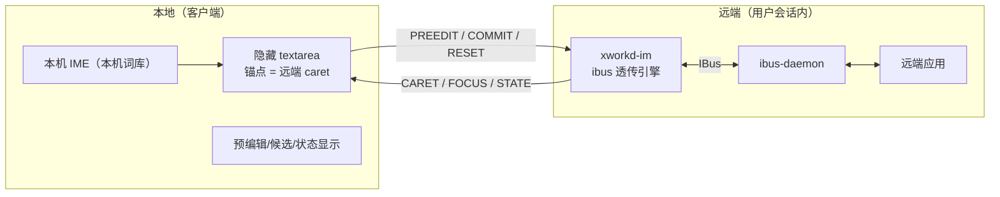

# 本机输入法（Input Method Remoting）设计稿

状态：**已实现并实测通过（2026-09-12）**。本文保留作设计依据；
下面 §4/§5 的文件名已是最终实现，实测结论与已知限制见 §12。
技术栈决策（2026-09-12）：**远端引擎用 ibus（C + libibus/GLib）**，与 xworkd 同为 C + meson；
**fcitx5 暂不考虑**（后续如需支持，作为可选后端另加）。
已定（2026-09-12）：① 先做 Python PoC 再落 C（PoC 已删，见 §9）；② 引擎**随 xworkd 服务端一起构建与安装**；
③ `PREEDIT` **携带** preedit 内光标位置（拿不到时退化为末尾）。

## 1. 背景与现状

现状输入链路：客户端只发**物理键码**，字符由远端 OS / 输入法产生。

```
Electron: window.keydown → MSG_KEY(event.code)
  → src/input.c: keysym_from_code() → XKeysymToKeycode() → XTestFakeKeyEvent()
```

`XKeysymToKeycode()` 对"不在键盘布局里的字符"返回 0 → 直接丢弃。所以：

- 要输入中文，**必须**依赖远端装了中文输入法；
- 用户只能用远端的词库/习惯，而不是自己本机的；
- 客户端也无法感知远端输入法的候选与状态。

目标：**用户使用本机的输入法与词库**，同时让"正在组词的那几个字母"显示在远端画面里、并尽量贴近远端光标。

非目标：分发/切换远端输入法引擎，支持 Wayland 原生会话（本项目为 X11-only），支持 fcitx5。

## 2. 目标形态与兜底

三种形态，本次实现前两种：

| 形态 | 组词 | preedit（拼音字母）显示 | 提交（汉字） | 位置 |
|---|---|---|---|---|
| **① 目标态：本机组词 + 远端透传引擎** | 本地 IME | 远端应用自己画（`update_preedit_text`） | 远端引擎 `commit_text`（**无需 XTEST 注入**） | 引擎收 `set_cursor_location` → 精确 |
| ② 兜底：本机组词 + 客户端浮层 | 本地 IME | 客户端在画面里画浮层 | XTEST keysym 重映射注入（或剪贴板粘贴） | 远端 caret 或锚点近似 |
| ③ 未来可选：远端引擎组词 + 客户端画 UI | 远端 IME | 客户端画 | 引擎提交 | 精确 |

关键认识：

- **必须做 IM engine，而不是 panel（Kimpanel / IBus Panel）**——只有引擎具备 `update_preedit_text` /
  `commit_text` / `set_cursor_location`，也就是"把 preedit 送进远端应用自己显示"的能力。
- 远端引擎**不组词**，只是"透传"：把客户端送来的 preedit 交给应用显示、把 commit 交给应用输入。
  由此顺带解决"远端中文 IME 截获注入文本"的问题（远端的中文引擎被我们的透传引擎取代）。
- 位置不是"读"出来的，而是**远端应用上报给引擎的**（`set_cursor_location`），我们把矩形回传客户端。

## 3. 架构



## 4. 模块划分

**远端**

- `im/xworkd-im.c` —— ibus 引擎进程：GObject + GLib main loop；实现 `IBusEngine` 的
  `set-cursor-location` / `focus-in` / `focus-out` / `reset` / `process-key-event`，
  并调用 `update_preedit_text()` / `commit_text()` / `hide_preedit_text()`；
  通过 AF_UNIX 与 xworkd 通信。
- `im/xworkd-im.xml` —— ibus component 注册文件（`<engine>` 名如 `xworkd-im`）。
- `build`：meson 新增目标，二进制装到 `/usr/libexec/xworkd/xworkd-im`。

**xworkd**

- 会话建立/接管时以**该用户身份**拉起引擎进程，继承 `DISPLAY` / `XAUTHORITY` /
  `DBUS_SESSION_BUS_ADDRESS`；进程退出/会话销毁时清理。
- `AF_UNIX` socket 服务端：`/run/xworkd/im-<uid>.sock`（0600，属主为会话用户）。
- 把引擎事件转成 WS 消息发给客户端；把客户端的 preedit/commit 转给引擎。
- 负责"切换引擎 / 恢复原引擎"（客户端勾选开关时触发）。

**客户端（Electron 渲染层 + 主进程）**

- `src/core/localim.ts`（最终实现名）——组合事件 → `MSG_IM_PREEDIT` / `MSG_IM_COMMIT`；
  接收 `MSG_IM_CARET` 维护锚点；管理隐藏输入框与"当前是否处于本机输入法模式"。
- `src/input.ts` —— 改动：
  - `event.isComposing === true` 或 `keyCode === 229` → **不转发**（交给本地 IME）；
  - `setLocalIME(on)` + `isLocalReservedKey()`：输入法切换键留在本地（**实现只做了 `Meta`/`Win`
    与 `Ctrl+Space`**，Windows 单按 `Shift`、macOS 的 `Cmd` 组合等见 §13）；
  - 组词的"提交/取消"在 `core/localim.ts` 里处理（**不在** input.ts）。
- 隐藏 `<textarea>`：`opacity: 0`、`wrap="off"` + `white-space: nowrap`、始终 `focus()`；
  位置 = 当前锚点。**尺寸不能是 1×1**：Windows 的 IME 靠 Chromium 上报的"组词串文字范围"
  算候选窗位置，1px 宽 + `overflow:hidden` 会让这个范围退化成一条缝（还会被自动横滚），
  表现为"拼音越长、候选窗越往左"。现为 `40em×16px`（高仍是一行，与客户端 `CARET_LIFT_Y` 对齐）。
- UI：状态指示（"输入法：就绪 / 被切走 / 远端引擎不可用"，写进 HUD）、
  引擎不可用时的通知、主机配置里的勾选框。

## 5. 协议

### 5.1 引擎 ↔ xworkd（AF_UNIX，帧：`type(1) + len(2, LE) + payload`）

| 方向 | type | payload |
|---|---|---|
| 引擎 → xworkd | `CARET` | `x, y, w, h`（各 i16，屏幕坐标，可含负值） |
| 引擎 → xworkd | `FOCUS` | `1` / `0` |
| 引擎 → xworkd | `STATE` | 预留（引擎是否被系统切走、属性） |
| xworkd → 引擎 | `PREEDIT` | UTF-8 串（可选附加 preedit 光标位置） |
| xworkd → 引擎 | `COMMIT` | UTF-8 串 |
| xworkd → 引擎 | `RESET` | 空 |

约束：单帧 ≤ 1KB；文本必须 UTF-8 且做长度校验；socket 权限 0600。

### 5.2 xworkd ↔ 客户端（WS 新消息，号段从 `0x20` 起，避开已用 0x01–0x1f）

- `MSG_IM_ENABLE`（客户端 → 服务端）：开启/关闭本机输入法模式（服务端据此切/恢复引擎）。
- `MSG_IM_PREEDIT`（客户端 → 服务端）：当前 preedit 串。
- `MSG_IM_COMMIT`（客户端 → 服务端）：提交文本。
- `MSG_IM_RESET`（客户端 → 服务端）：丢弃当前组合（失焦/切标签/点别处）。
- `MSG_IM_CARET`（服务端 → 客户端）：`x, y, w, h`（远端屏幕坐标）。
- `MSG_IM_FOCUS`（服务端 → 客户端）：远端输入焦点变化。

## 6. 客户端行为

主机配置新增布尔字段（`localIM`，默认 `false`）：**使用本机输入法（输入内容在远端显示）**。

**开启时**

1. 主进程/服务端：记录远端当前 ibus 引擎 → 切到 `xworkd-im`。
2. 渲染层：启用隐藏输入框 + 组合事件分流（字符走 `PREEDIT`/`COMMIT`，快捷键仍走 `MSG_KEY`）。
3. 锚点：**远端插入点一变就重摆**（`MSG_IM_CARET` → `setCaret()` → `syncToCaret()`），
   **不是"组合开始时定位一次"** —— Windows 上远端组词期间往往一次 caret 都不上报，只在组词
   开始摆一次就会用到过期位置；拿不到 caret 时退回跟随鼠标。0×0 是"没有真实插入点"的占位值，
   **不能当成 (0,0) 使用**（否则候选窗会跑到左上角）。
4. 位置换算：远端屏幕坐标 → 被捕获显示区域 → 画面坐标 → 本地 CSS 坐标，
   复用现有 `fit/stretch/pixel` 换算；越界时钳制在窗口内。

**关闭时**

1. 清 preedit（`hide_preedit_text`）、清隐藏输入框。
2. 服务端切回记录的**原引擎**。
3. 恢复正常按键转发（完全等同于当前行为）。

**保留键表（本地保留，不转发、不 `preventDefault`）**

- Linux：`Super+Space`（GNOME 全局抓取，通常窗口收不到，天然生效）、`Ctrl+Space`。
- Windows：`Win+Space`、`Ctrl+Space`、`Ctrl+Shift`、`Alt+Shift`；**单按 `Shift` 切中英**要单独规则
  （短按不转发、带组合才转发）。
- macOS：`Ctrl+Space`、`Ctrl+Option+Space`、`Cmd+Space`、`CapsLock`/🌐；
  另外 Electron 菜单键（`Cmd+Q/W/H`）需在主进程用 `before-input-event` 处理。
- 每主机可编辑 + 一键恢复平台默认；提供"按住某修饰键时全部透传"的应急开关。

## 7. 关键细节与坑

- **preedit 发送**：本地每敲一键都会 `compositionupdate`；实现是**每次都发**（**未做**"同一帧只发
  最后一次"的节流）—— 单条 preedit 很短，实测不构成压力；若要节流，按帧合并即可，协议无需改。
- **reset**：远端引擎 `focus-out`/`reset`、客户端失焦/切标签/点别处，都必须丢弃或提交当前组合。
- **按键不被消费**：引擎 `process_key_event` 恒返回 `false`，否则应用收不到普通按键。
- **引擎被切走**：用户或系统可能切走引擎（如按了输入法切换键）：引擎收到 `disable` 后上报
  `STATE`，客户端提示"已退回远端输入法"，避免静默失效。按需重新切回。
- **必须把引擎挂成桌面环境的"输入源"**（GNOME 下必须，已实测）：GNOME Wayland 下引擎调度者是
  gnome-shell，它按 `org.gnome.desktop.input-sources` 行事，`ibus engine` 单方面设置会被覆盖；
  需要先把引擎加进该列表并切为当前源，并在关闭本机输入法时恢复原值。
  X11 下 GTK 应用直连 ibus IM 模块，`ibus engine` + 焦点即可生效；但为兼容两者，应统一走"改输入源"这条路。
- **组件 XML 必须有 `<homepage>`**（可为空元素，照 chewing.xml）：缺它时 `ibus write-cache`
  报 `g_variant_new_string: assertion 'string != NULL' failed` 并可能写坏用户组件缓存，
  导致 daemon 组件表为空（`ibus list-engine` 返回 0 个引擎）。
- **必须调 `ibus_bus_register_component()`**（硬要求，已在 PoC 上验证）：只靠组件 XML +
  `ibus_bus_request_name()`，ibus 1.5.32 的 daemon 会把工厂代理挂到一条未导出
  `/org/freedesktop/IBus/Factory` 的连接上，切换时报
  `UnknownMethod: Object does not exist at path "/org/freedesktop/IBus/Factory"`，
  且是瞬时失败（不是 5s 超时）。daemon 处理 `RegisterComponent` 时用的是发起注册的连接
  （`bus/ibusimpl.c:_ibus_register_component`）。详细复盘见 §12。
- **坐标语义**：ibus 的 `set_cursor_location` 是屏幕坐标；多显示器时可能为负或超出抓取区域，
  需换算并钳制。
- **降级**：应用不支持 IM（游戏、Java/Swing、部分自绘控件）→ 收不到 caret、也不显示 preedit；
  此时退回形态 ②（客户端浮层 + XTEST 注入提交）。XTEST keysym 重映射实现等价于 `xdotool type`
  （临时占用空闲 keycode → `XChangeKeyboardMapping` → `XTestFakeKeyEvent` → 还原），
  备用方案是"写远端剪贴板 + 合成 Ctrl+V"。
- **安全**：socket 0600；帧长度校验；引擎不直连客户端（鉴权与网络边界都由 xworkd 负责）。

## 8. 安装与部署

- 引擎二进制：`/usr/libexec/xworkd/xworkd-im`。
- component 注册：`/usr/share/ibus/component/xworkd-im.xml`，安装后执行 `ibus write-cache`。
- socket：`/run/xworkd/xworkd-im-<uid>-<display>.sock`（0600，属主为会话用户）；
  socket 目录 `/run/xworkd` 必须 **0711（可穿越）**，否则会话用户连不上自己的 socket。
- 拉起方式：**不在会话启动时直接拉起** —— 引擎由 **ibus-daemon 按组件注册激活**，xworkd 只负责
  "切成当前输入源"；xworkd 用 `XWORKD_IM_SOCK` 把 socket 路径交给会话，但引擎不能只靠环境变量
  （daemon 的启动方式决定环境继承），它会再用 `DISPLAY` 自行推导同一路径（多候选尝试）。
- **分发方式（已定）**：引擎由 xworkd 同一个 meson 工程构建，**随服务端一起安装**：
  `deploy/install.sh` 装二进制与 component XML，`tools/make-server-bundle.sh` 的产物里一并带上。
  注意：`libibus-1.0-dev` 只是构建期依赖，构建时用 `dependency('ibus-1.0', required: false)`
  做成可选目标，缺头文件时不影响主程序构建（本机当前就未安装该 dev 包）。
- 卸载：停进程 → 删 XML → `ibus write-cache` → 恢复原引擎。

## 9. PoC（已完成使命，验证器已从仓库删除）

PoC 验证器（Python + PyGObject 的最小 ibus 引擎，当时放在 `tools/im-poc/`）**已删除**，
这里只保留结论 —— 需要原始脚本时看 git 历史里引入正式实现之前的提交。当时的做法是：
在 X11 + `zenity --entry`（GTK3）上手工驱动引擎（`F9` 推进一步 preedit、`F10` 提交「你好」、
`F11` 隐藏，其余按键一律返回 `False` 不消费），并在 gedit / gnome-terminal(VTE) / Firefox
的输入框里各试一遍。

结论（三条关键假设全部成立）：

- 应用会**上报插入点矩形**（实测 `x=811 y=596 w=0 h=34`，随文本变化右移）→ 候选窗定位可用；
- `update_preedit_text` 让应用**在自己的输入框里**显示预编辑串（`nihao`，带下划线）；
- `commit_text` 直接插入「你好」，**完全不需要按键注入**（XTEST）；
- 普通打字与快捷键不受影响（引擎不消费按键）。

三个当年踩到、也是正式实现必须处理的坑：组件 XML 必须有 `<homepage>`、必须调
`ibus_bus_register_component()`、GNOME 下必须把引擎挂成**输入源**（只 `ibus engine` 会被覆盖）。
细节见 §7 与 §12。

> 当时计划的「降级名单」（哪些应用收不到 caret / 不显示 preedit）**未系统整理**，属未做项；
> 实际用到的兜底是：拿不到插入点时候选窗退回跟随鼠标（见 §13）。

## 10. 工作量与阶段

| 阶段 | 内容 | 粗估 |
|---|---|---|
| 1 | Python PoC（验证位置语义与 preedit 兼容性） | 1–2 天 |
| 1.5 | 运行时 `register_component` 修正（已验证：不做则引擎无法被切到） | 已完成 | 
| 2 | C 版 ibus 引擎 + component XML + meson 目标 | 3–7 天 |
| 3 | 会话内拉起 + AF_UNIX + xworkd 转发 + WS 新消息 | 2–4 天 |
| 4 | 客户端（分流/锚点/浮层/状态/保留键/切换与恢复） | 3–5 天 |
| 5 | 兜底形态 ②（浮层 + XTEST 注入）与文档 | 2–4 天 |

## 11. 决策记录与剩余未决项

已定（2026-09-12）：

1. **先做 Python PoC 再落 C** —— 已完成，验证器已删（结论见 §9）。
2. **引擎随 xworkd 服务端一起构建与安装**（meson 可选目标 + `deploy/install.sh` + server-bundle）。
3. **`PREEDIT` 携带 preedit 内光标位置**（客户端取隐藏输入框的 `selectionStart` 减去 preedit 起始偏移；
   取不到时退化为末尾）。

仍需后续定：

1. **会话隔离**：是否每个会话一个引擎实例（多会话/多用户并发时的策略，socket 名与 D-Bus 名可能需带 uid/session 后缀）。
2. **引擎被切走时的策略**：只在客户端提示，还是尝试自动切回。
3. **形态 ② 的注入细节**：XTEST keysym 重映射为主 + 粘贴兜底；emoji（非 BMP）是否单独走粘贴。
4. **候选窗定位**：用控件坐标还是 preedit 光标坐标（PoC 记录后再定）。
5. **构建期依赖**：`libibus-1.0-dev` 只在构建引擎时需要，CI/打包机要装。

## 12. 实现完成状态与实测结论（2026-09-12）

### 文件清单（最终实现）

| 位置 | 作用 |
|---|---|
| `im/xworkd-im.c` | ibus 中继引擎（不组词、不消费按键；preedit/commit 交给应用，caret 回传） |
| `im/xworkd-im.xml` | ibus 组件注册（**必须带 `<homepage>`**） |
| `src/im_proto.h` | 通道帧格式与文本校验（xworkd 与引擎**共用**） |
| `src/im.{h,c}` | 每会话一条 AF_UNIX 通道的服务端（建/收 socket、半包粘包、EAGAIN 续发） |
| `src/sessproc.c` | `im_open()` + 把 `XWORKD_IM_SOCK` 交给会话；`im_session_switch()` 切/恢复输入源 |
| `src/session_msg.c` | `MSG_IM_*` 分发与引擎事件回推（含状态去重） |
| `test/test_im.c` | 通道单测（帧编解码边界 + 生命周期） |
| `tools/im-dev/localtest.py` | 隔离对照测试（私有 dbus/ibus + zenity 截图） |
| `tools/im-dev/imcheck.py` | 端到端接线检查（登录→socket→转发→切源→清理） |

### 实测结论（要点）

- **三条假设全部成立**：应用上报插入点矩形（且随文本右移）、`update_preedit_text`
  显示在应用**自己的输入框**里、`commit_text` 直接落字（无需按键注入）、普通按键透传。
- **引擎进程由 ibus 激活，不常驻**：所以必须把引擎挂成 GNOME **输入源**再切过去；
  只发 `ibus engine` 会被覆盖。改完输入源再显式切一次引擎可以催它起来。
- **不得让会话缺输入源**：`gsettings set sources "@a(ss) []"`（显式空数组）会让 GNOME
  的输入源列表真的变空（本机中文输入法直接消失）。所以：只在原值非空时才写回，
  原值为空时用 `gsettings reset`。
- **同用户共用 dconf**：若会话用户与本地桌面用户相同（本机主机），切/恢复输入源会
  同时影响桌面设置（关闭/断开时恢复）。这是 GNOME 的模型决定的，无法按会话隔离。
- **socket 路径不能靠环境变量单传**：引擎由 ibus-daemon 拉起，环境能否继承取决于
  daemon 的启动方式，所以引擎会用 `DISPLAY` 自己推出同一个路径（多候选尝试）。
- **`/run/xworkd` 必须可穿越（0711）**：目录 0700 时，会话用户连自己的 socket 会失败
  （引擎在跑却永远接不上）。

### 已完成 / 待办

- 已完成：引擎、通道、切源、客户端接入、部署（`deploy/install.sh` + 服务端包）、
  UI（勾选项 / 状态指示 / 不可用通知 / 本地保留键）。
- 待办（本设计稿的“未来可选”）：形态 ②（不支持 IM 的应用 → 客户端浮层 + XTEST 注入）；
  preedit 阶段显示拼音（需 IBus auxiliary text 通道，见 §7）。

## 13. 实现与设计稿的差异（以代码为准，2026-09-12）

设计稿写在前、实现落地在后，下面这些地方**实现已经偏离设计稿**，改动时别按 §6/§7 的原文来：

1. **候选窗定位**：不是“组合开始时定位一次”，而是**远端插入点一变就重摆**
   （`setCaret()` → `syncToCaret()`）。Windows 上远端组词期间常常一次 caret 都不报，
   只在组词开始摆一次 = 用过期位置，甚至一直停在鼠标兜底的位置上。
   落点还有三个校准常量（`CARET_LIFT_Y` / `OFF_X` / `OFF_Y`，在
   `frontend/src/core/localim.ts` 顶部）：本机 IME 把候选窗画在隐藏框“框内插入点”的下方，
   不预扣一个行高就会整体偏低一个字。
2. **隐藏输入框几何**：`40em×16px`（**不是** 1×1）。1px 宽 + `overflow:hidden` 时，
   Windows 的 IME 拿到的“组词串文字范围”会退化成一条缝、还会被 Chromium 自动横滚，
   表现为“拼音越长、候选窗越往左”；Linux/ibus 只取插入点原点，所以只有 Windows 暴露这个问题。
3. **不做横向“抵消”**：框只按远端插入点左端摆一次，框内插入点随组词串自然右移
   （曾经用 `measureText` 量出串宽去减，方向反了 → 越打越往左，已删除）。
4. **保留键**：只实现了 `Meta`/`Win` 与 `Ctrl+Space`（`src/input.ts` 的 `isLocalReservedKey()`）。
   §6 表里 Windows 单按 `Shift`、macOS `Cmd` 组合等**未实现**。
5. **preedit 无节流**：每次 `compositionupdate` 都发（见 §7 注）。
6. **形态 ② / fcitx5 / auxiliary text 显示拼音**：均未实现（见 §12 待办）。
7. **日志**：引擎与通道的调试**不再写文件** —— xworkd 侧走 stderr（systemd journal，
   `journalctl -u xworkd | grep IM`）；客户端侧进内存环形缓冲，由「关于 → 生成日志报告」导出
   （scope `[im]`；`place(caret)` = 按远端插入点摆框，`place(mouse)` = 退回跟随鼠标，
   `compositionupdate …（scrollLeft=…）` 里的 `scrollLeft` 恒为 0 才说明隐藏框没被横滚）。
   引擎自身调试需让 `XWORKD_IM_DEBUG=1` 出现在**会话环境**里（引擎由 ibus-daemon 拉起）。
